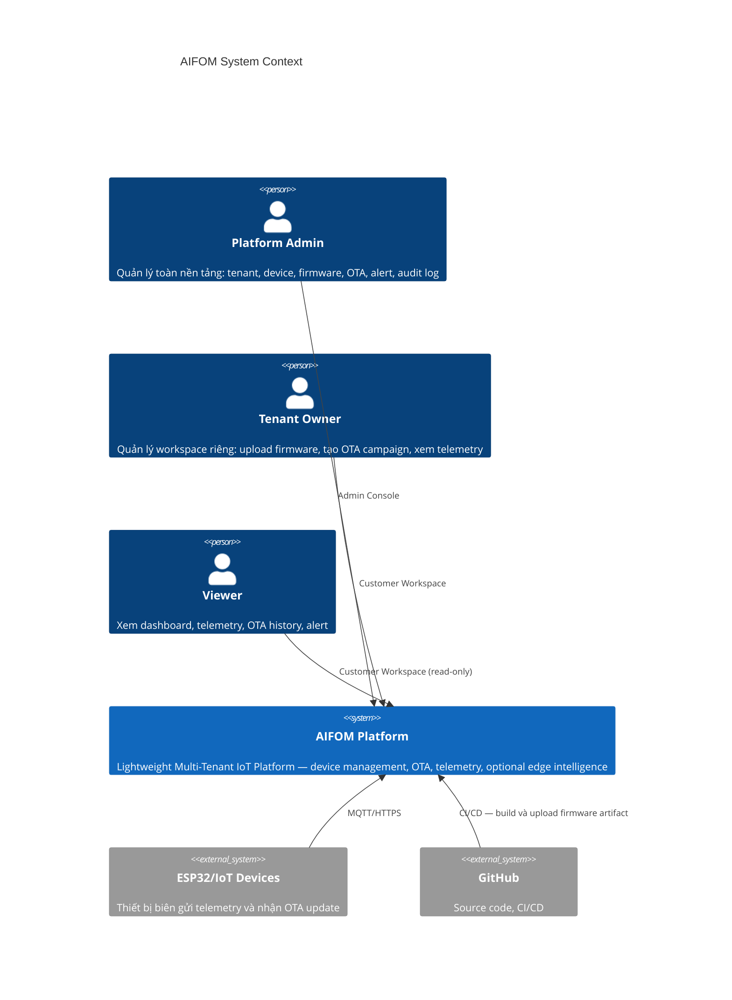
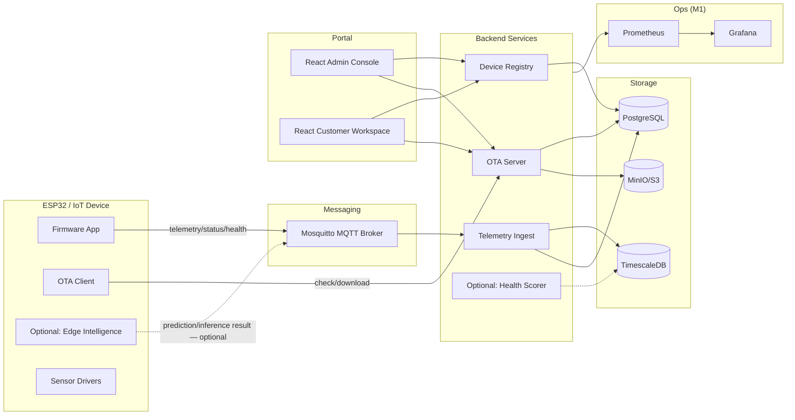
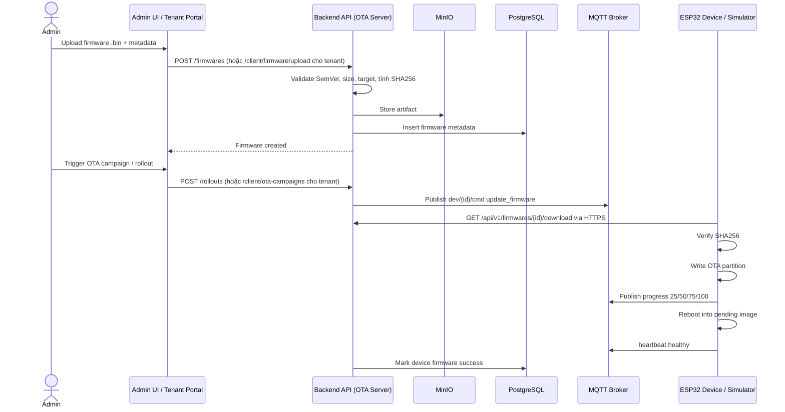
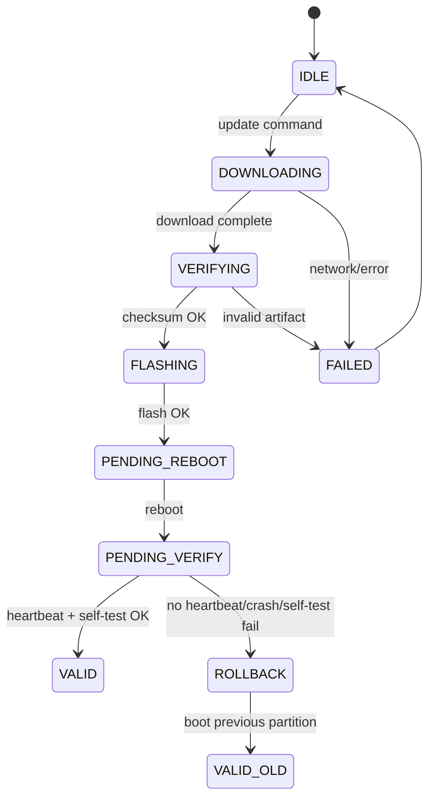
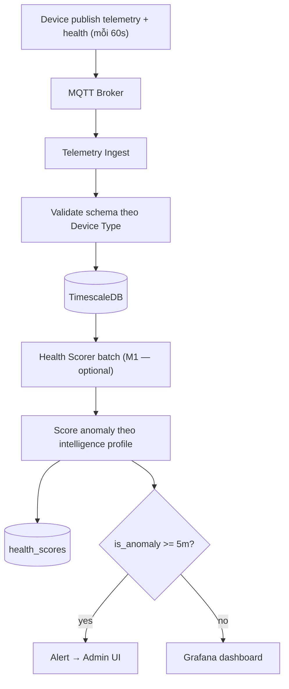
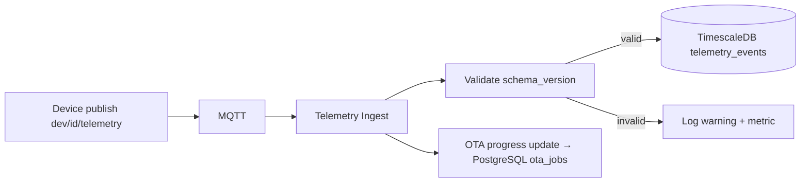
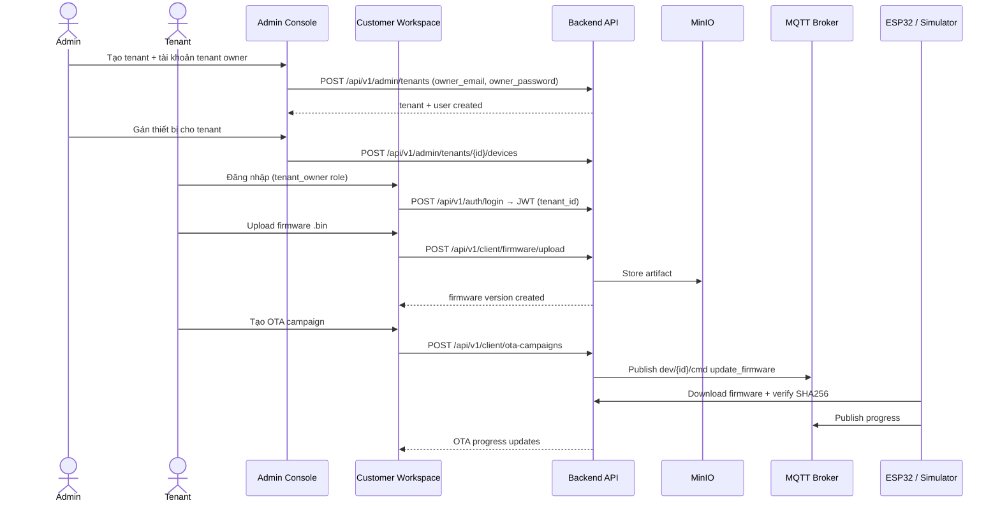
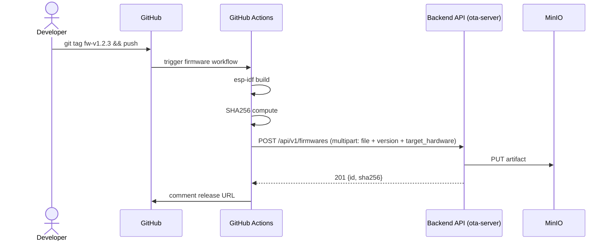
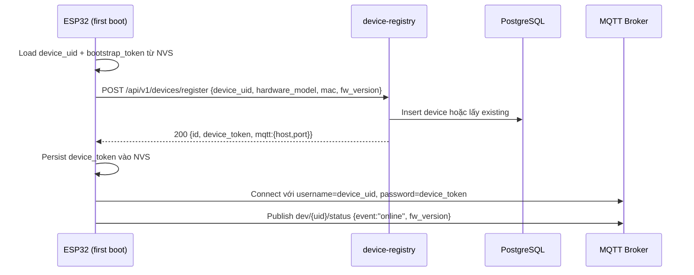

> [!NOTE]
> **TÀI LIỆU ĐẶC TẢ LỊCH SỬ / BẢN THIẾT KẾ HỌC THUẬT (HISTORICAL SPECIFICATION & RESEARCH ROADMAP)**
>
> - **Mục đích tài liệu**: Tài liệu này là bản đặc tả kỹ thuật gốc được thiết kế cho lộ trình nghiên cứu học thuật 24 tháng của đề tài tốt nghiệp.
> - **Phạm vi triển khai thực tế (Current Scoped Implementation)**: Phạm vi hệ thống thực tế đã triển khai và nghiệm thu bảo vệ được quy định chuẩn tại [`docs/scope.md`](../../scope.md).
> - **Các thành phần đã tinh giản (Scoped-out / Future Work)**:
>   1. **AI / TinyML / MLOps**: Module TinyML biên, mô hình IsolationForest server-side và MLOps đã được tinh gọn thành định hướng nghiên cứu mở rộng; hệ thống không còn API `/api/v1/anomaly` hay MQTT topic `ml/*`.
>   2. **Bộ giả lập Simulator**: Toàn bộ cụm simulator phần mềm (`simulate_fleet.py`, `simulate_device.py`) đã được loại bỏ; nghiệm thu và demo thực tế sử dụng 100% phần cứng ESP32 vật lý (xem [`docs/esp32_firmware_setup.md`](../../esp32_firmware_setup.md)).
>   3. **Phân quyền người dùng (RBAC)**: Đã loại bỏ vai trò `platform_engineer` và `tenant_engineer` cùng giao diện `/console/engineer` (xem báo cáo kỹ thuật [`docs/reports/engineer-removal-2026-10-03.md`](../../reports/engineer-removal-2026-10-03.md)). Hệ thống hiện tại vận hành chuẩn 3 vai trò: `admin`, `tenant_owner`, và `viewer` (xem [`docs/access_control.md`](../../access_control.md)).
>   4. **Hạ tầng bổ trợ & Thương mại**: Các dịch vụ Prometheus, Grafana, MLflow, cổng tài liệu API tùy biến, website quảng bá và giao diện billing thương mại đã được gỡ bỏ khỏi stack chạy chính.

# 02 – Architecture Specification

## 1. Mục tiêu kiến trúc

Kiến trúc phải đủ nhỏ để một cá nhân có thể triển khai trong đồ án, nhưng đủ rõ để chứng minh tư duy hệ thống: IoT, OTA, multi-tenant, security, và observability.

Nguyên tắc:

- **Modular Monolith** — không phải microservices. Tất cả bounded contexts nằm trong một FastAPI deployable, nhưng ranh giới domain được tách rõ qua DDD/Clean Architecture.
- Dữ liệu trạng thái quan trọng phải lưu DB, không chỉ giữ trong RAM.
- OTA phải có state machine và rollback.
- Device không được tin tuyệt đối vào server: phải verify checksum/signature.
- Mọi service phải có healthcheck, log và metric.
- TinyML/edge intelligence là **tùy chọn mở rộng** — không phải trục chính. Mỗi loại thiết bị có thể có hoặc không có intelligence profile.

## 1b. Kiến trúc Modular Monolith với Bounded Contexts

> **Cập nhật 2026-05-27:** Backend đã được refactor sang Modular Monolith pattern với DDD/Clean Architecture. Đây KHÔNG phải microservices — tất cả bounded contexts deploy trong một FastAPI process.

### Nguyên tắc kiến trúc

1. **Modular Monolith, không phải Microservices.** Một codebase, một deployable, một database. Ranh giới domain được tách qua bounded contexts, không qua network.
2. **DDD/Clean Architecture áp dụng dần dần.** Mỗi bounded context có 4 layer: `domain/`, `application/`, `infrastructure/`, `presentation/`.
3. **Backward compatibility.** Mọi API path hiện tại được giữ nguyên. Old modules vẫn tồn tại làm compatibility wrapper.
4. **Additive changes.** Chỉ thêm, không xóa. Old modules, old imports, old API paths đều được preserve.

### Bounded Contexts

```
backend/app/
  bounded_contexts/
    identity/                    — authentication, users, roles, JWT
    tenant_management/           — tenants, service plans, feature flags, device mapping
    device_registry/             — devices, device capabilities, presence monitoring
    telemetry/                   — telemetry ingest, storage, queries
    firmware_ota/                — firmware versions, OTA jobs, MinIO integration
    project_dashboard/           — tenant projects, pages, widgets
    tinyml_model_management/     — anomaly events, ML model registry
  shared/
    domain/                      — events, exceptions, value objects
    application/                 — unit of work, pagination, error codes
    infrastructure/              — DB session, config, logging, metrics
    presentation/                — dependencies, error handlers
  modules/                       — legacy modules (compatibility wrappers, still functional)
```

### Bounded Context Ownership

| Bounded Context | Tables Owned | Legacy Module |
|----------------|-------------|---------------|
| identity | users | modules/auth |
| tenant_management | tenants, service_plans, tenant_feature_overrides, tenant_device_mappings | modules/tenants |
| device_registry | devices, device_types, device_capabilities, device_credentials, device_status_events, device_health | modules/devices |
| telemetry | telemetry, telemetry_schemas | modules/telemetry |
| firmware_ota | firmware_versions, firmware_profiles, ota_jobs, ota_campaigns, ota_campaign_targets, ota_job_events | modules/firmware, modules/ota |
| project_dashboard | tenant_projects, project_pages, project_widgets | modules/projects |
| tinyml_model_management | anomaly_events, intelligence_profiles, ml_models, ml_model_versions, model_artifacts, model_deployments, model_predictions, health_scores | modules/anomaly |
| shared/cross-cutting | audit_logs, alerts | modules/audit, modules/alerts |

### Clean Architecture Layers

Mỗi bounded context tuân theo:

```
domain/          — entities (ORM re-exports), value objects (enums, constants), business rules
application/     — schemas (Pydantic re-exports), use cases (business logic orchestration)
infrastructure/  — adapters (repository wrappers), external service clients (MQTT, MinIO)
presentation/    — FastAPI routers, dependencies
```

**Quy tắc:**
- `domain/` KHÔNG import FastAPI, SQLAlchemy, Pydantic, MQTT, MinIO.
- `application/` chỉ import domain + infrastructure interfaces.
- `infrastructure/` import legacy modules qua module reference (để monkeypatch trong test hoạt động).
- `presentation/` import application + infrastructure.

### Import Strategy cho Test Compatibility

Tests monkeypatch legacy module attributes trực tiếp. Để đảm bảo monkeypatch hoạt động:

```python
# presentation/router.py
from app.modules.projects import repository as project_repository  # module reference
# Khi gọi: project_repository.validate_widget_binding(...)
# Test monkeypatch: monkeypatch.setattr(project_repository, "validate_widget_binding", lambda...)
# → Monkeypatch intercept correctly vì cùng module object.
```

**KHÔNG** dùng adapter wrapper cho các function bị monkeypatch trong test — adapter tạo indirection mà monkeypatch không thể穿透.

## 2. C4 Context



## 3. Container Architecture



> Các thành phần nét đứt (`-.->`) là **tùy chọn** (M1/SHOULD) — không bắt buộc cho MVP.

## 3b. Role-based access

| Role | Area | Quyền |
|---|---|---|
| Platform Admin | Admin Console `/` | Full access — tất cả tenant, tất cả device, firmware toàn cục, OTA toàn cục, audit log |
| Tenant Owner | Customer Workspace `/client/*` | Chỉ tenant của mình: xem device, upload firmware, tạo/cancel OTA campaign, quản lý team |
| Tenant Engineer | Customer Workspace `/client/*` | Upload firmware, tạo OTA campaign, debug, xem log — không quản lý tenant/team |
| Viewer | Customer Workspace `/client/*` | View only — xem device, OTA status, telemetry, alert; không tạo được gì |

`tenant_id` **KHÔNG** được lấy từ request body/query. Backend luôn resolve từ JWT sub → DB `user.tenant_id`.

## 4. Phân cấp khái niệm thiết bị

```
Tenant
  └── Device Group        (nhóm logic do tenant tổ chức)
        └── Device Type   (loại phần cứng: energy_meter, env_sensor, motor_monitor...)
              ├── Telemetry Schema     (định nghĩa trường dữ liệu của loại thiết bị)
              ├── Firmware Profile     (firmware version phù hợp loại này)
              └── Intelligence Profile (optional: rule-based / TinyML — có thể null)

OTA Campaign
  ├── Firmware binary (artifact .bin đã compile)
  ├── Target device type hoặc device group
  ├── Chỉ thiết bị thuộc tenant của người tạo campaign
  ├── Publish MQTT command đến thiết bị
  └── Device báo OTA progress: created → sent → downloading → flashing → success/failed
```

### Ví dụ Intelligence Profile theo Device Type

| Device Type | Telemetry Fields | Intelligence Profile |
|---|---|---|
| Energy meter | voltage, current, power, energy_kwh | Rule: over-current alert; Optional: electricity anomaly model |
| Environment sensor | temperature_c, humidity_pct, gas_ppm | Rule: threshold warning; Optional: env anomaly rule |
| Industrial motor monitor | vibration_g, temp_c, rpm | Optional: predictive maintenance model |
| Relay controller | relay_state, uptime_s, last_cmd | No intelligence required |

> MVP demo chỉ một intelligence profile mẫu (electricity anomaly) để minh chứng tích hợp. Không giả định một mô hình duy nhất cho tất cả thiết bị.

## 5. Backend service ownership và port

| Service | Cổng nội bộ | Cổng host | Trách nhiệm | DB/storage |
|---|---:|---:|---|---|
| api (main) | 8000 | 8000 | Modular Monolith: tất cả bounded contexts (identity, tenant_management, device_registry, telemetry, firmware_ota, project_dashboard, tinyml_model_management) | PostgreSQL + TimescaleDB + MinIO + MQTT publisher |
| frontend | 80 | 5173 (vite dev) | Admin Console + Customer Workspace | none |

> **Cập nhật 2026-05-27:** Backend là Modular Monolith — một FastAPI app chứa tất cả bounded contexts. KHÔNG phải microservices. Ranh giới domain được tách qua DDD bounded contexts, không qua network.

### Bounded Context → Router Mapping

| Bounded Context | Router Source | API Prefix |
|---|---|---|
| identity | `bounded_contexts/identity/presentation/router.py` | `/api/v1/auth/*` |
| tenant_management (admin) | `bounded_contexts/tenant_management/presentation/router_admin.py` | `/api/v1/admin/*` |
| tenant_management (client) | `bounded_contexts/tenant_management/presentation/router_client.py` | `/api/v1/client/*` |
| device_registry | `modules/devices/router.py` | `/api/v1/devices/*` |
| device_registry (types) | `modules/devices/router_device_types.py` | `/api/v1/admin/device-types/*` |
| telemetry | `bounded_contexts/telemetry/presentation/router.py` | `/api/v1/telemetry/*` |
| firmware_ota (firmware) | `bounded_contexts/firmware_ota/presentation/router_firmware.py` | `/api/v1/firmware/*` |
| firmware_ota (ota) | `bounded_contexts/firmware_ota/presentation/router_ota.py` | `/api/v1/ota/*` |
| project_dashboard | `bounded_contexts/project_dashboard/presentation/router.py` | `/api/v1/client/projects/*`, `/api/v1/client/pages/*`, `/api/v1/client/widgets/*`, `/api/v1/client/devices/*/capabilities`, `/api/v1/client/devices/*/commands` |
| tinyml_model_management | `bounded_contexts/tinyml_model_management/presentation/router.py` | `/api/v1/anomaly/*` |
| shared/cross-cutting (audit) | `modules/audit/router.py` | `/api/v1/admin/audit-logs/*` |
| shared/cross-cutting (alerts) | `modules/alerts/router.py` | (via client router) |

Service tùy chọn (M1/SHOULD):

| Service | Trách nhiệm |
|---|---|
| health-scorer | Batch worker score health anomaly, tạo alert |
| realtime-gateway | WebSocket fan-out cho UI realtime (thay thế polling) |

## 6. Luồng OTA firmware



## 7. Luồng rollback



## 8. Luồng edge intelligence (tùy chọn — M1/SHOULD)

> Luồng này chỉ áp dụng cho thiết bị có Intelligence Profile. Thiết bị không có profile này bỏ qua hoàn toàn.



> Health Scorer là service tùy chọn (SHOULD/M1). MVP không yêu cầu.

## 9. Luồng telemetry



## 10. Luồng Tenant OTA Self-Service



## 11. Luồng CI/CD firmware release



## 12. Luồng device registration



## 13. Deployment topology

### Local development (M0)

- Docker Compose chạy PostgreSQL, TimescaleDB, MinIO, Mosquitto, backend API.
- Frontend dev server chạy trên host.
- Device simulator chạy bằng Python.
- ESP32 thật trỏ về IP máy dev.

### Staging/demo (M2 optional)

- K3s single-node với Traefik Ingress.
- cert-manager cho HTTPS.
- PersistentVolume cho DB/MinIO.
- GitHub Actions deploy image mới.

## 14. Nguyên tắc mở rộng

- Service phải stateless nếu có thể.
- File artifact không lưu local trong container, chỉ lưu MinIO/S3.
- Telemetry nhiều dòng lưu TimescaleDB, metadata lưu PostgreSQL.
- Tenant isolation bắt buộc ở cấp DB query (không chỉ ở UI).
- Intelligence profile là optional per device type — không bắt buộc, không giả định một model duy nhất.
- Rollout phải hỗ trợ canary: 1 device trước, sau đó subset, cuối cùng toàn fleet.
