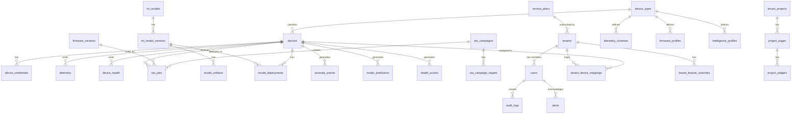

> [!NOTE]
> **TÀI LIỆU ĐẶC TẢ LỊCH SỬ / BẢN THIẾT KẾ HỌC THUẬT (HISTORICAL SPECIFICATION & RESEARCH ROADMAP)**
>
> - **Mục đích tài liệu**: Tài liệu này là bản đặc tả kỹ thuật gốc được thiết kế cho lộ trình nghiên cứu học thuật 24 tháng của đề tài tốt nghiệp.
> - **Phạm vi triển khai thực tế (Current Scoped Implementation)**: Phạm vi hệ thống thực tế đã triển khai và nghiệm thu bảo vệ được quy định chuẩn tại [`docs/scope.md`](../../scope.md).
> - **Các thành phần đã tinh giản (Scoped-out / Future Work)**:
>   1. **AI / TinyML / MLOps**: Module TinyML biên, mô hình IsolationForest server-side và MLOps đã được tinh gọn thành định hướng nghiên cứu mở rộng; hệ thống không còn API `/api/v1/anomaly` hay MQTT topic `ml/*`.
>   2. **Bộ giả lập Simulator**: Toàn bộ cụm simulator phần mềm (`simulate_fleet.py`, `simulate_device.py`) đã được loại bỏ; nghiệm thu và demo thực tế sử dụng 100% phần cứng ESP32 vật lý (xem [`docs/esp32_firmware_setup.md`](../../esp32_firmware_setup.md)).
>   3. **Phân quyền người dùng (RBAC)**: Đã loại bỏ vai trò `platform_engineer` và `tenant_engineer` cùng giao diện `/console/engineer` (xem báo cáo kỹ thuật [`docs/reports/engineer-removal-2026-10-03.md`](../../reports/engineer-removal-2026-10-03.md)). Hệ thống hiện tại vận hành chuẩn 3 vai trò: `admin`, `tenant_owner`, và `viewer` (xem [`docs/access_control.md`](../../access_control.md)).
>   4. **Hạ tầng bổ trợ & Thương mại**: Các dịch vụ Prometheus, Grafana, MLflow, cổng tài liệu API tùy biến, website quảng bá và giao diện billing thương mại đã được gỡ bỏ khỏi stack chạy chính.

# 04 – Database Schema

## 1. Nguyên tắc lưu trữ

- PostgreSQL lưu metadata: devices, firmware, rollout, model, users, audit logs.
- TimescaleDB lưu telemetry/health/time-series có tần suất cao.
- MinIO lưu artifact: firmware `.bin`, model `.tflite`, logs lớn, dataset snapshot.

> **Cập nhật 2026-05-27:** Schema hiện tại có **32 bảng** (15 gốc + 10 P0 + 7 P1). Tất cả managed qua Alembic migrations (`0001` → `0002` → `0003`). Không dùng MLflow — ML model metadata quản lý trực tiếp trong PostgreSQL.

## 1b. Migration History

| Migration | Revision | Tables Added | Description |
|-----------|----------|-------------|-------------|
| 0001_initial_schema.py | 0001 | 15 | All original tables |
| 0002_architecture_completion.py | 0002 | 10 + 15 ALTER | P0 tables (device_types, telemetry_schemas, firmware_profiles, device_credentials, ota_campaigns, ota_campaign_targets, ota_job_events, device_status_events, device_health, alerts) + safe ALTERs |
| 0003_tinyml_model_management.py | 0003 | 7 | P1 tables (intelligence_profiles, ml_models, ml_model_versions, model_artifacts, model_deployments, model_predictions, health_scores) |

## 1c. Bounded Context Table Ownership

| Bounded Context | Tables | Count |
|----------------|--------|-------|
| identity | users | 1 |
| tenant_management | tenants, service_plans, tenant_feature_overrides, tenant_device_mappings | 4 |
| device_registry | devices, device_types, device_capabilities, device_credentials, device_status_events*, device_health* | 6 |
| telemetry | telemetry, telemetry_schemas | 2 |
| firmware_ota | firmware_versions, firmware_profiles, ota_jobs, ota_campaigns, ota_campaign_targets, ota_job_events | 6 |
| project_dashboard | tenant_projects, project_pages, project_widgets | 3 |
| tinyml_model_management | anomaly_events, intelligence_profiles, ml_models, ml_model_versions, model_artifacts, model_deployments, model_predictions*, health_scores* | 8 |
| shared/cross-cutting | audit_logs, alerts | 2 |

*Bảng đánh dấu `*` là TimescaleDB hypertable candidate — được tạo dưới dạng bảng bình thường, có thể convert sang hypertable khi TimescaleDB khả dụng.*

## 2. Domain entities



Lưu ý field `devices.firmware_version` và `devices.model_version` là **denormalized cache** cập nhật từ heartbeat hoặc `ota_jobs.success`. Lịch sử thay đổi nằm trong `device_status_events` và `ota_jobs`/`model_deployments`.

## 3. PostgreSQL DDL – metadata

```sql
CREATE EXTENSION IF NOT EXISTS "uuid-ossp";
CREATE EXTENSION IF NOT EXISTS "pgcrypto";

CREATE TYPE device_status AS ENUM ('unknown', 'online', 'offline', 'maintenance', 'quarantined');
CREATE TYPE firmware_status AS ENUM ('uploaded', 'signed', 'staging', 'production', 'deprecated', 'quarantined');
CREATE TYPE ota_job_status AS ENUM ('pending', 'notified', 'downloading', 'verifying', 'flashing', 'rebooting', 'success', 'failed', 'rolled_back', 'cancelled');
CREATE TYPE rollout_status AS ENUM ('draft', 'running', 'paused', 'completed', 'failed', 'cancelled');
CREATE TYPE model_stage AS ENUM ('none', 'staging', 'production', 'archived');
CREATE TYPE model_deployment_status AS ENUM ('pending', 'downloading', 'active', 'failed', 'rolled_back');
CREATE TYPE alert_severity AS ENUM ('info', 'warning', 'critical');
CREATE TYPE alert_status AS ENUM ('open', 'acknowledged', 'resolved');

CREATE TABLE devices (
    id UUID PRIMARY KEY DEFAULT uuid_generate_v4(),
    device_uid VARCHAR(128) UNIQUE NOT NULL,
    display_name VARCHAR(255),
    hardware_model VARCHAR(64) NOT NULL,
    firmware_version VARCHAR(64),
    model_version VARCHAR(64),
    status device_status NOT NULL DEFAULT 'unknown',
    ip_address INET,
    mac_address VARCHAR(32),
    last_seen_at TIMESTAMPTZ,
    registered_at TIMESTAMPTZ NOT NULL DEFAULT now(),
    metadata JSONB NOT NULL DEFAULT '{}'::jsonb
);

CREATE INDEX idx_devices_status ON devices(status);
CREATE INDEX idx_devices_hardware_model ON devices(hardware_model);
CREATE INDEX idx_devices_last_seen ON devices(last_seen_at DESC);

CREATE TABLE device_credentials (
    id UUID PRIMARY KEY DEFAULT uuid_generate_v4(),
    device_id UUID NOT NULL REFERENCES devices(id) ON DELETE CASCADE,
    credential_type VARCHAR(32) NOT NULL, -- jwt, mtls_cert, api_key
    public_key TEXT,
    cert_fingerprint VARCHAR(128),
    token_hash VARCHAR(255),
    expires_at TIMESTAMPTZ,
    revoked_at TIMESTAMPTZ,
    created_at TIMESTAMPTZ NOT NULL DEFAULT now()
);

CREATE TABLE firmwares (
    id UUID PRIMARY KEY DEFAULT uuid_generate_v4(),
    version VARCHAR(64) NOT NULL,
    git_sha VARCHAR(64),
    target_hardware VARCHAR(64) NOT NULL,
    file_name VARCHAR(255) NOT NULL,
    object_key TEXT NOT NULL,
    size_bytes BIGINT NOT NULL CHECK (size_bytes > 0),
    sha256 VARCHAR(64) NOT NULL,
    signature TEXT,
    signing_key_id VARCHAR(128),
    status firmware_status NOT NULL DEFAULT 'uploaded',
    release_notes TEXT,
    created_by UUID,
    created_at TIMESTAMPTZ NOT NULL DEFAULT now(),
    promoted_at TIMESTAMPTZ,
    UNIQUE(version, target_hardware)
);

CREATE INDEX idx_firmwares_target_status ON firmwares(target_hardware, status);

CREATE TABLE rollouts (
    id UUID PRIMARY KEY DEFAULT uuid_generate_v4(),
    name VARCHAR(255) NOT NULL,
    firmware_id UUID REFERENCES firmwares(id),
    model_id UUID,
    target_query JSONB NOT NULL DEFAULT '{}'::jsonb,
    strategy VARCHAR(32) NOT NULL DEFAULT 'manual', -- manual, canary, percentage, all
    percentage INT CHECK (percentage >= 0 AND percentage <= 100),
    status rollout_status NOT NULL DEFAULT 'draft',
    failure_threshold_pct NUMERIC(5,2) DEFAULT 5.0,
    started_at TIMESTAMPTZ,
    completed_at TIMESTAMPTZ,
    created_at TIMESTAMPTZ NOT NULL DEFAULT now()
);

CREATE TABLE ota_jobs (
    id UUID PRIMARY KEY DEFAULT uuid_generate_v4(),
    rollout_id UUID REFERENCES rollouts(id),
    device_id UUID NOT NULL REFERENCES devices(id),
    firmware_id UUID NOT NULL REFERENCES firmwares(id),
    status ota_job_status NOT NULL DEFAULT 'pending',
    progress_pct INT NOT NULL DEFAULT 0 CHECK (progress_pct >= 0 AND progress_pct <= 100),
    error_code VARCHAR(128),
    error_message TEXT,
    previous_firmware_version VARCHAR(64),
    started_at TIMESTAMPTZ,
    finished_at TIMESTAMPTZ,
    created_at TIMESTAMPTZ NOT NULL DEFAULT now(),
    updated_at TIMESTAMPTZ NOT NULL DEFAULT now(),
    UNIQUE(device_id, firmware_id, rollout_id)
);

CREATE INDEX idx_ota_jobs_device_status ON ota_jobs(device_id, status);
CREATE INDEX idx_ota_jobs_rollout_status ON ota_jobs(rollout_id, status);

CREATE TABLE models (
    id UUID PRIMARY KEY DEFAULT uuid_generate_v4(),
    name VARCHAR(128) NOT NULL,
    version VARCHAR(64) NOT NULL,
    mlflow_run_id VARCHAR(128),
    mlflow_model_uri TEXT,
    target_hardware VARCHAR(64) NOT NULL,
    task_type VARCHAR(64) NOT NULL, -- gesture, keyword, anomaly
    input_shape JSONB NOT NULL,
    output_labels JSONB NOT NULL DEFAULT '[]'::jsonb,
    tensor_arena_size INT,
    size_bytes BIGINT,
    sha256 VARCHAR(64),
    accuracy NUMERIC(6,4),
    f1_score NUMERIC(6,4),
    latency_ms NUMERIC(10,3),
    ram_peak_kb NUMERIC(10,3),
    stage model_stage NOT NULL DEFAULT 'none',
    created_at TIMESTAMPTZ NOT NULL DEFAULT now(),
    promoted_at TIMESTAMPTZ,
    UNIQUE(name, version, target_hardware)
);

CREATE TABLE model_deployments (
    id UUID PRIMARY KEY DEFAULT uuid_generate_v4(),
    device_id UUID NOT NULL REFERENCES devices(id),
    model_id UUID NOT NULL REFERENCES models(id),
    status model_deployment_status NOT NULL DEFAULT 'pending',
    previous_model_version VARCHAR(64),
    progress_pct INT NOT NULL DEFAULT 0 CHECK (progress_pct >= 0 AND progress_pct <= 100),
    error_code VARCHAR(128),
    error_message TEXT,
    deployed_at TIMESTAMPTZ,
    rolled_back_at TIMESTAMPTZ,
    created_at TIMESTAMPTZ NOT NULL DEFAULT now(),
    updated_at TIMESTAMPTZ NOT NULL DEFAULT now()
);

CREATE INDEX idx_model_deployments_device_status ON model_deployments(device_id, status);

CREATE TABLE alerts (
    id UUID PRIMARY KEY DEFAULT uuid_generate_v4(),
    severity alert_severity NOT NULL DEFAULT 'warning',
    status alert_status NOT NULL DEFAULT 'open',
    source VARCHAR(64) NOT NULL,         -- health-scorer, ota-server, prometheus
    code VARCHAR(128) NOT NULL,          -- HEALTH_ANOMALY_PERSISTENT, OTA_FAILURE_RATE_HIGH...
    resource_type VARCHAR(64),           -- device, firmware, rollout, model
    resource_id VARCHAR(128),
    message TEXT NOT NULL,
    details JSONB NOT NULL DEFAULT '{}'::jsonb,
    first_seen_at TIMESTAMPTZ NOT NULL DEFAULT now(),
    last_seen_at TIMESTAMPTZ NOT NULL DEFAULT now(),
    acknowledged_at TIMESTAMPTZ,
    acknowledged_by UUID REFERENCES users(id),
    resolved_at TIMESTAMPTZ
);

CREATE INDEX idx_alerts_status_severity ON alerts(status, severity);
CREATE INDEX idx_alerts_resource ON alerts(resource_type, resource_id);

CREATE TABLE users (
    id UUID PRIMARY KEY DEFAULT uuid_generate_v4(),
    email VARCHAR(255) UNIQUE NOT NULL,
    password_hash TEXT NOT NULL,
    role VARCHAR(32) NOT NULL DEFAULT 'admin',
    created_at TIMESTAMPTZ NOT NULL DEFAULT now(),
    disabled_at TIMESTAMPTZ
);

CREATE TABLE audit_logs (
    id UUID PRIMARY KEY DEFAULT uuid_generate_v4(),
    actor_user_id UUID REFERENCES users(id),
    action VARCHAR(128) NOT NULL,
    resource_type VARCHAR(64) NOT NULL,
    resource_id VARCHAR(128),
    ip_address INET,
    metadata JSONB NOT NULL DEFAULT '{}'::jsonb,
    created_at TIMESTAMPTZ NOT NULL DEFAULT now()
);
```

## 4. Multi-tenant schema

> **Phase 12 — đã implement 2026-05-20.** Các bảng này là MUST vì đây là nền tảng cho toàn bộ luồng multi-tenant.

```sql
-- Service plans (dùng làm feature flag cho demo, billing là optional/future)
CREATE TYPE plan_tier AS ENUM ('free', 'starter', 'professional', 'enterprise');

CREATE TABLE service_plans (
    id UUID PRIMARY KEY DEFAULT uuid_generate_v4(),
    name VARCHAR(64) NOT NULL UNIQUE,
    tier plan_tier NOT NULL DEFAULT 'starter',
    max_devices INT NOT NULL DEFAULT 10,
    max_users INT NOT NULL DEFAULT 5,
    features JSONB NOT NULL DEFAULT '{}'::jsonb,
    is_active BOOLEAN NOT NULL DEFAULT TRUE,
    created_at TIMESTAMPTZ NOT NULL DEFAULT now()
);

-- Tenants (customers)
CREATE TABLE tenants (
    id UUID PRIMARY KEY DEFAULT uuid_generate_v4(),
    name VARCHAR(255) NOT NULL,
    slug VARCHAR(64) NOT NULL UNIQUE,
    plan_id UUID REFERENCES service_plans(id),
    status VARCHAR(32) NOT NULL DEFAULT 'active', -- active, suspended, cancelled
    contact_email VARCHAR(255),
    created_at TIMESTAMPTZ NOT NULL DEFAULT now(),
    updated_at TIMESTAMPTZ NOT NULL DEFAULT now()
);

CREATE INDEX idx_tenants_slug ON tenants(slug);

-- Users now have tenant_id for tenant users (NULL for platform admins)
ALTER TABLE users ADD COLUMN IF NOT EXISTS tenant_id UUID REFERENCES tenants(id);
CREATE INDEX idx_users_tenant_id ON users(tenant_id);

-- Device to tenant assignment
CREATE TABLE tenant_device_mapping (
    id UUID PRIMARY KEY DEFAULT uuid_generate_v4(),
    tenant_id UUID NOT NULL REFERENCES tenants(id) ON DELETE CASCADE,
    device_id UUID NOT NULL REFERENCES devices(id) ON DELETE CASCADE,
    assigned_at TIMESTAMPTZ NOT NULL DEFAULT now(),
    UNIQUE(tenant_id, device_id)
);

-- Per-tenant feature overrides (override plan defaults)
CREATE TABLE tenant_feature_overrides (
    id UUID PRIMARY KEY DEFAULT uuid_generate_v4(),
    tenant_id UUID NOT NULL REFERENCES tenants(id) ON DELETE CASCADE,
    feature_key VARCHAR(128) NOT NULL,
    is_enabled BOOLEAN NOT NULL DEFAULT TRUE,
    updated_at TIMESTAMPTZ NOT NULL DEFAULT now(),
    UNIQUE(tenant_id, feature_key)
);
```

> **Lưu ý bảo mật**: Firmware và OTA campaigns trong Customer Workspace được scoped theo `tenant_id` của user (lấy từ JWT). Backend **KHÔNG** lấy `tenant_id` từ request body/query — chỉ từ `user.tenant_id` trong DB sau khi resolve JWT sub.

## 5. TimescaleDB DDL – time-series

```sql
CREATE EXTENSION IF NOT EXISTS timescaledb;

CREATE TABLE telemetry_events (
    time TIMESTAMPTZ NOT NULL,
    device_uid VARCHAR(128) NOT NULL,
    sensor_type VARCHAR(64) NOT NULL,
    value DOUBLE PRECISION,
    unit VARCHAR(32),
    payload JSONB NOT NULL DEFAULT '{}'::jsonb
);
SELECT create_hypertable('telemetry_events', 'time', if_not_exists => TRUE);
CREATE INDEX idx_telemetry_device_time ON telemetry_events(device_uid, time DESC);

CREATE TABLE device_status_events (
    time TIMESTAMPTZ NOT NULL,
    device_uid VARCHAR(128) NOT NULL,
    event_type VARCHAR(64) NOT NULL,
    firmware_version VARCHAR(64),
    model_version VARCHAR(64),
    payload JSONB NOT NULL DEFAULT '{}'::jsonb
);
SELECT create_hypertable('device_status_events', 'time', if_not_exists => TRUE);

CREATE TABLE device_health (
    time TIMESTAMPTZ NOT NULL,
    device_uid VARCHAR(128) NOT NULL,
    free_heap INTEGER,
    min_free_heap INTEGER,
    uptime_sec BIGINT,
    wifi_rssi INTEGER,
    cpu_idle_pct DOUBLE PRECISION,
    mqtt_publish_rate DOUBLE PRECISION,
    error_count_1h INTEGER,
    ota_fail_count INTEGER,
    reboot_count_24h INTEGER,
    temp_chip DOUBLE PRECISION,
    task_high_watermark INTEGER,
    payload JSONB NOT NULL DEFAULT '{}'::jsonb
);
SELECT create_hypertable('device_health', 'time', if_not_exists => TRUE);
CREATE INDEX idx_health_device_time ON device_health(device_uid, time DESC);

CREATE TABLE health_scores (
    time TIMESTAMPTZ NOT NULL,
    device_uid VARCHAR(128) NOT NULL,
    model_name VARCHAR(128) NOT NULL,
    model_version VARCHAR(64) NOT NULL,
    anomaly_score DOUBLE PRECISION NOT NULL,
    is_anomaly BOOLEAN NOT NULL,
    reason JSONB NOT NULL DEFAULT '{}'::jsonb
);
SELECT create_hypertable('health_scores', 'time', if_not_exists => TRUE);
CREATE INDEX idx_health_scores_device_time ON health_scores(device_uid, time DESC);
CREATE INDEX idx_health_scores_anomaly_time ON health_scores(is_anomaly, time DESC);

CREATE TABLE model_predictions (
    time TIMESTAMPTZ NOT NULL,
    device_uid VARCHAR(128) NOT NULL,
    model_name VARCHAR(128) NOT NULL,
    model_version VARCHAR(64) NOT NULL,
    predicted_label VARCHAR(64),
    confidence DOUBLE PRECISION,
    latency_ms DOUBLE PRECISION,
    payload JSONB NOT NULL DEFAULT '{}'::jsonb
);
SELECT create_hypertable('model_predictions', 'time', if_not_exists => TRUE);
```

## 6. Retention policy đề xuất

```sql
SELECT add_retention_policy('telemetry_events', INTERVAL '90 days', if_not_exists => TRUE);
SELECT add_retention_policy('device_status_events', INTERVAL '180 days', if_not_exists => TRUE);
SELECT add_retention_policy('device_health', INTERVAL '180 days', if_not_exists => TRUE);
SELECT add_retention_policy('health_scores', INTERVAL '180 days', if_not_exists => TRUE);
SELECT add_retention_policy('model_predictions', INTERVAL '90 days', if_not_exists => TRUE);
```

## 7. Data quality rules

Telemetry ingest phải validate:

- `device_uid` không rỗng.
- `time` không quá tương lai 5 phút.
- `sensor_type` nằm trong whitelist.
- `value` không NaN/Inf.
- Payload JSON không vượt size giới hạn.
- Health metric có range hợp lý:
  - `wifi_rssi`: -100 đến 0.
  - `cpu_idle_pct`: 0 đến 100.
  - `free_heap`: >= 0.
  - `uptime_sec`: >= 0.

## 8. Migration strategy

- Mọi thay đổi schema qua Alembic.
- Không sửa migration cũ sau khi merge main.
- Migration phá vỡ tương thích phải có ADR.
- Khi đổi MQTT payload schema, hỗ trợ song song version cũ ít nhất 1 sprint.
