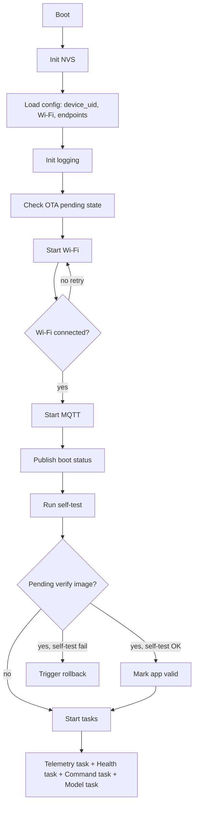

> [!NOTE]
> **TÀI LIỆU ĐẶC TẢ LỊCH SỬ / BẢN THIẾT KẾ HỌC THUẬT (HISTORICAL SPECIFICATION & RESEARCH ROADMAP)**
>
> - **Mục đích tài liệu**: Tài liệu này là bản đặc tả kỹ thuật gốc được thiết kế cho lộ trình nghiên cứu học thuật 24 tháng của đề tài tốt nghiệp.
> - **Phạm vi triển khai thực tế (Current Scoped Implementation)**: Phạm vi hệ thống thực tế đã triển khai và nghiệm thu bảo vệ được quy định chuẩn tại [`docs/scope.md`](../../scope.md).
> - **Các thành phần đã tinh giản (Scoped-out / Future Work)**:
>   1. **AI / TinyML / MLOps**: Module TinyML biên, mô hình IsolationForest server-side và MLOps đã được tinh gọn thành định hướng nghiên cứu mở rộng; hệ thống không còn API `/api/v1/anomaly` hay MQTT topic `ml/*`.
>   2. **Bộ giả lập Simulator**: Toàn bộ cụm simulator phần mềm (`simulate_fleet.py`, `simulate_device.py`) đã được loại bỏ; nghiệm thu và demo thực tế sử dụng 100% phần cứng ESP32 vật lý (xem [`docs/esp32_firmware_setup.md`](../../esp32_firmware_setup.md)).
>   3. **Phân quyền người dùng (RBAC)**: Đã loại bỏ vai trò `platform_engineer` và `tenant_engineer` cùng giao diện `/console/engineer` (xem báo cáo kỹ thuật [`docs/reports/engineer-removal-2026-10-03.md`](../../reports/engineer-removal-2026-10-03.md)). Hệ thống hiện tại vận hành chuẩn 3 vai trò: `admin`, `tenant_owner`, và `viewer` (xem [`docs/access_control.md`](../../access_control.md)).
>   4. **Hạ tầng bổ trợ & Thương mại**: Các dịch vụ Prometheus, Grafana, MLflow, cổng tài liệu API tùy biến, website quảng bá và giao diện billing thương mại đã được gỡ bỏ khỏi stack chạy chính.

# 07 – ESP32 Firmware Specification

## 1. Mục tiêu firmware

Firmware ESP32 phải chứng minh được thiết bị biên có thể:

- Khởi động ổn định.
- Kết nối Wi-Fi.
- Kết nối MQTT.
- Gửi telemetry/status/health/log.
- Nhận lệnh OTA/model update.
- Tải firmware qua HTTPS.
- Verify checksum/signature.
- Flash OTA partition.
- Rollback nếu firmware mới lỗi.
- Chạy inference TinyML tối thiểu.

## 2. Hardware target ban đầu

- ESP32 DevKit V1 / ESP32-WROOM-32.
- Sensor demo:
  - Giai đoạn 2: DHT11/DHT22 hoặc dữ liệu giả.
  - Giai đoạn 3: MPU6050 cho gesture hoặc ADXL345 cho anomaly.
- LED dùng báo trạng thái.
- Nút bấm optional để force OTA/check-in.

## 3. Partition table đề xuất

```csv
# Name,   Type, SubType, Offset,   Size, Flags
nvs,      data, nvs,     0x9000,   0x6000,
otadata,  data, ota,     0xf000,   0x2000,
phy_init, data, phy,     0x11000,  0x1000,
factory,  app,  factory, 0x20000,  0x140000,
ota_0,    app,  ota_0,   0x160000, 0x140000,
ota_1,    app,  ota_1,   0x2A0000, 0x140000,
storage,  data, spiffs,  0x3E0000, 0x20000,
```

Điều chỉnh size theo flash thực tế.

## 4. Firmware components

```txt
firmware/components/
├── config_manager/
├── wifi_manager/
├── mqtt_manager/
├── ota_manager/
├── sensor_manager/
├── health_monitor/
├── model_runtime/
├── command_handler/
└── app_state/
```

## 5. Boot sequence



## 6. FreeRTOS task design

| Task | Priority | Period | Trách nhiệm |
|---|---:|---:|---|
| wifi_task | high | event-driven | reconnect/backoff |
| mqtt_task | high | event-driven | publish/subscribe |
| telemetry_task | medium | 5s | đọc sensor, publish telemetry |
| health_task | medium | 60s | publish health metrics |
| command_task | medium | event-driven | xử lý command MQTT |
| ota_task | high | on demand | OTA update, không chạy song song |
| model_task | medium | per sample/window | inference TinyML |
| watchdog_task | low | 10s | sanity check |

## 7. MQTT command handling

Device subscribe:

```txt
dev/{device_uid}/cmd
fleet/{hardware_model}/cmd
```

Command types:

- `ping`
- `reboot`
- `update_firmware`
- `update_model`
- `set_config`
- `collect_sample`

Command handler phải:

1. Validate `schema_version`.
2. Check `command_id` chống chạy trùng.
3. Check command type.
4. Publish accepted/rejected.
5. Execute async nếu task dài.
6. Publish result.

## 8. OTA manager design

### State machine

```c
typedef enum {
    OTA_STATE_IDLE,
    OTA_STATE_CHECKING,
    OTA_STATE_DOWNLOADING,
    OTA_STATE_VERIFYING,
    OTA_STATE_FLASHING,
    OTA_STATE_REBOOTING,
    OTA_STATE_PENDING_VERIFY,
    OTA_STATE_SUCCESS,
    OTA_STATE_FAILED,
    OTA_STATE_ROLLBACK
} ota_state_t;
```

### OTA flow

1. Nhận command `update_firmware` hoặc periodic check.
2. Kiểm tra current version < target version.
3. Kiểm tra target hardware đúng.
4. Tải metadata: url, size, sha256, signature.
5. Tạo HTTPS client.
6. Tải firmware vào OTA partition bằng `esp_https_ota` hoặc custom stream.
7. Tính sha256 trong lúc tải hoặc sau tải.
8. Verify signature với public key nhúng trong firmware/factory partition.
9. Set boot partition.
10. Reboot.
11. Firmware mới chạy self-test.
12. Nếu OK: `esp_ota_mark_app_valid_cancel_rollback()`.
13. Nếu fail/crash/no heartbeat: bootloader rollback.

### Progress reporting

Publish topic:

```txt
dev/{device_uid}/ota/progress
```

At least:

- 0% accepted
- 25% downloading
- 50% downloaded half
- 75% verifying/flashing
- 100% success before reboot if possible
- failure with `error_code`

### Error codes

| Code | Meaning |
|---|---|
| OTA_NETWORK_TIMEOUT | mất mạng/tải timeout |
| OTA_HTTP_ERROR | HTTP status không hợp lệ |
| OTA_SIZE_EXCEEDED | file lớn hơn partition |
| OTA_SHA256_MISMATCH | checksum sai |
| OTA_SIGNATURE_INVALID | chữ ký sai |
| OTA_FLASH_FAILED | ghi partition lỗi |
| OTA_REBOOT_FAILED | không reboot được |
| OTA_SELF_TEST_FAILED | firmware mới self-test fail |

## 9. Model runtime design

### Model storage

- Giai đoạn đầu (Sprint 16): model nhúng compile-time trong `model.cc` từ `xxd -i`.
- Giai đoạn sau (Sprint 18+): model blob lưu vào `storage` partition (SPIFFS), boot up đọc ra RAM.

### Model header

```c
#define MODEL_MAGIC 0x41494D4C // "AIML"

typedef struct {
    uint32_t magic;
    uint16_t header_version;
    uint16_t model_type;
    char model_name[64];
    char model_version[32];
    uint32_t model_size;
    uint8_t sha256[32];
    uint32_t tensor_arena_size;
} model_blob_header_t;
```

### Model update flow (theo lệnh `update_model`)

1. `command_handler` nhận `dev/{uid}/cmd` với `type=update_model`.
2. Validate `target_hardware` khớp; nếu sai → publish ack `rejected` với `error_code=MODEL_TARGET_MISMATCH`.
3. Validate `tensor_arena_size` ≤ partition spiffs còn trống và RAM cấu hình.
4. Gọi HTTPS GET `download_url` (kèm `X-Device-Token`).
5. Stream vào file tạm `/spiffs/model_new.tflite` đồng thời update SHA256.
6. Verify SHA256 == metadata. Sai → xóa file, publish ack `failed` với `error_code=MODEL_SHA_MISMATCH`.
7. Verify Ed25519 signature (cùng public key như firmware). Sai → `error_code=MODEL_SIGNATURE_INVALID`.
8. Atomic rename `/spiffs/model_new.tflite` → `/spiffs/model.tflite`. Lưu metadata `current_model = "{name}@{version}"` vào NVS.
9. Reload model trong `model_runtime` (stop inference task → re-init TFLite Micro → start).
10. Self-test inference với 1 sample. Lỗi → restore previous file (giữ `model.tflite.bak`) và rollback.
11. Publish `dev/{uid}/cmd/ack` với `result=completed`, sau đó cập nhật `POST /api/v1/models/{id}/deployments` với `status=active`.

Không reboot khi update model (khác OTA firmware). Inference task tạm dừng 1–2s.

### Model update error codes (firmware-side)

| Code | Meaning |
|---|---|
| MODEL_TARGET_MISMATCH | hardware_model không khớp |
| MODEL_TOO_LARGE | size vượt arena/partition |
| MODEL_DOWNLOAD_FAILED | HTTPS error |
| MODEL_SHA_MISMATCH | checksum sai |
| MODEL_SIGNATURE_INVALID | signature sai |
| MODEL_LOAD_FAILED | TFLite Micro init lỗi |
| MODEL_SELFTEST_FAILED | inference test sample fail |

### Inference pipeline gesture

```txt
MPU6050 sample @100Hz -> ring buffer 200 samples -> normalize -> int8 quantize -> TFLite Micro invoke -> argmax -> confidence -> publish prediction
```

## 10. Health metrics

Firmware phải publish:

- `free_heap`
- `min_free_heap`
- `uptime_sec`
- `wifi_rssi`
- `mqtt_publish_rate`
- `error_count_1h`
- `ota_fail_count`
- `reboot_count_24h`
- `temp_chip` nếu có
- `task_high_watermark`

## 11. NVS config keys

| Key | Type | Meaning |
|---|---|---|
| device_uid | string | ID thiết bị |
| wifi_ssid | string | SSID |
| wifi_pass | string | password, không log |
| mqtt_host | string | broker host |
| mqtt_port | int | broker port |
| api_base_url | string | backend URL |
| current_model | string | model version |
| last_command_id | string | chống lặp command |

## 12. Firmware logs

Format nên dễ grep:

```txt
I OTA_MANAGER: state=DOWNLOADING firmware=1.2.3 progress=25
W WIFI_MANAGER: reconnect attempt=3 reason=timeout
E OTA_MANAGER: error=OTA_SHA256_MISMATCH expected=... actual=...
```

## 13. Test plan firmware

### Local build

```bash
cd iot/firmware
idf.py set-target esp32
idf.py build
```

### Flash

```bash
idf.py -p /dev/ttyUSB0 flash monitor
```

### OTA test cases

1. Firmware mới hợp lệ -> update success.
2. Firmware checksum sai -> reject, không flash.
3. Mất Wi-Fi giữa chừng -> fail mềm, device vẫn chạy version cũ.
4. Firmware crash trong startup -> rollback.
5. Gửi lại command_id cũ -> ignore duplicate.

## 14. Implementation order

1. Blink + logging.
2. NVS config.
3. Wi-Fi manager.
4. MQTT manager.
5. Telemetry fake data.
6. Health publish.
7. Command handler.
8. OTA basic without signature.
9. OTA checksum.
10. OTA signature.
11. Rollback validation.
12. Sensor real.
13. TinyML compile-time.
14. Model update from server.
